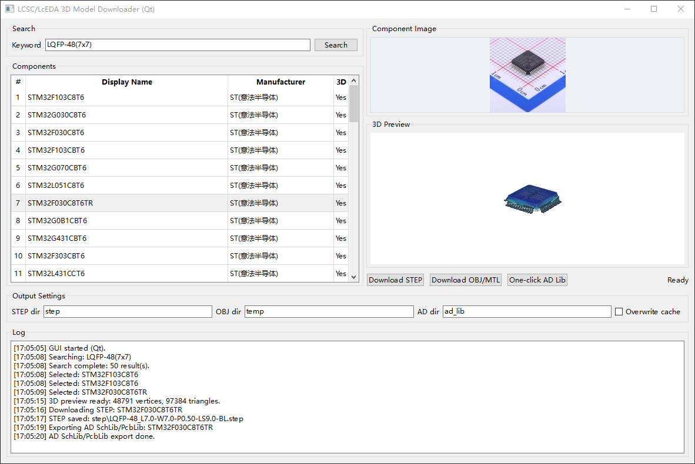
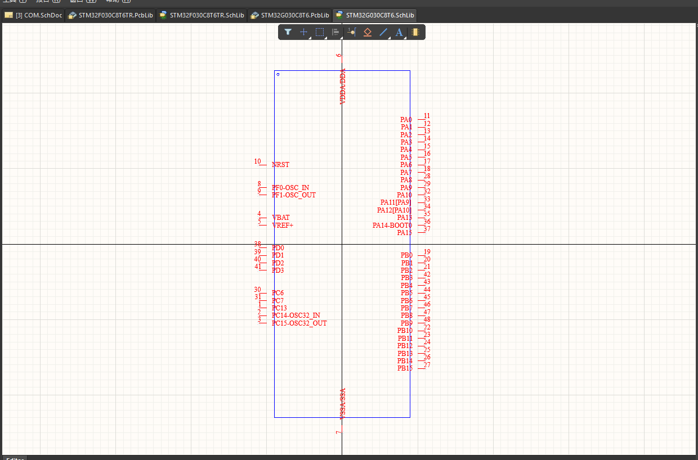
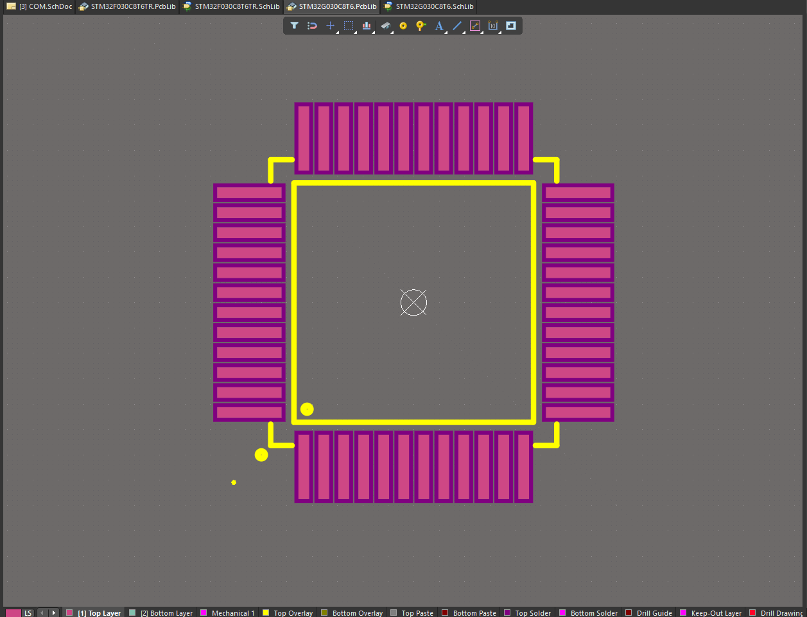

# lceda_downloader 
一键下载立创的器件3D模型和原理图封装、PCB封装，AD格式。

### 📑 介绍
该项目主要用于下载立创器件的3D模型和原理图封装和PCB封装，供AD使用，原理图封装还有点小问题，将就用，不够流畅。。。

  

  

  

### ⚙ 软件架构
python+pyQT6

### 📋 致谢

本项目部分功能/实现思路参考了 [seishinkouki/lceda_step_downloader](https://github.com/seishinkouki/lceda_step_downloader)。

感谢原作者的开源工作。
